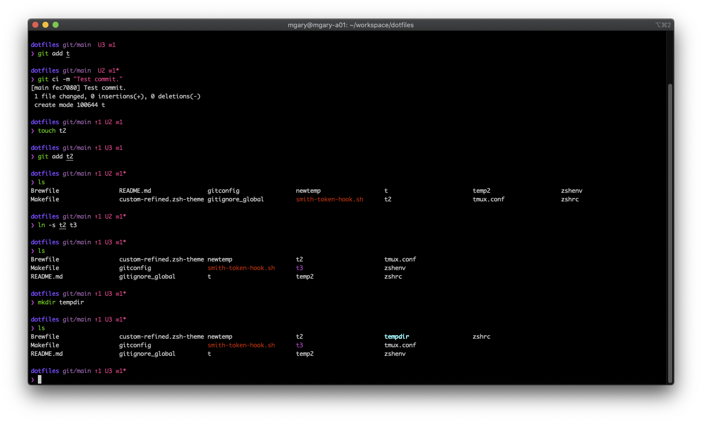

# Mirah's Dotfiles



This exists primarily for the purposes of backing up my config, especially after I lost all my zsh config once in the middle of customizing it.

## Setup

Clone the repo, then run `make setup`
```
git clone git@github.com:MirahImage/dotfiles.git && \
    cd dotfiles && \
    make setup
```

The `keys` target for loading SSH and GPG keys for interacting with GitHub is interactive and fetches secrets from lastpass, so it is not included in the `setup` target.
