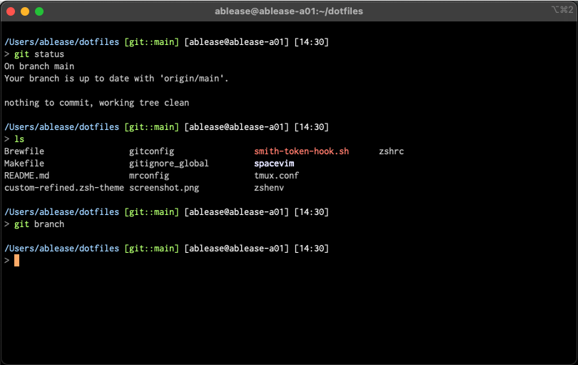

# My dotfiles

Inspired/stolen from Mirah's dotfiles. Thanks Mirah!

This exists primarily for the purposes of backing up my config, especially after I lost all my zsh config once in the middle of customizing it.

## Setup

1. Clone the repo, then run `make setup`
```
git clone git@github.com:ablease/dotfiles.git
```

1. Before you do anything, configure the git-config with yor GPG key
```
[user]
  name = Alex Blease
  email = alexblease@vmware.com
  program = /usr/local/bin/gpg
	signingkey = < your signing key here >
```

1. Install all the things with
```
make setup
```

The `keys` target for loading SSH and GPG keys for interacting with GitHub is interactive and fetches secrets from lastpass, so it is not included in the `setup` target.

## Screenshots

